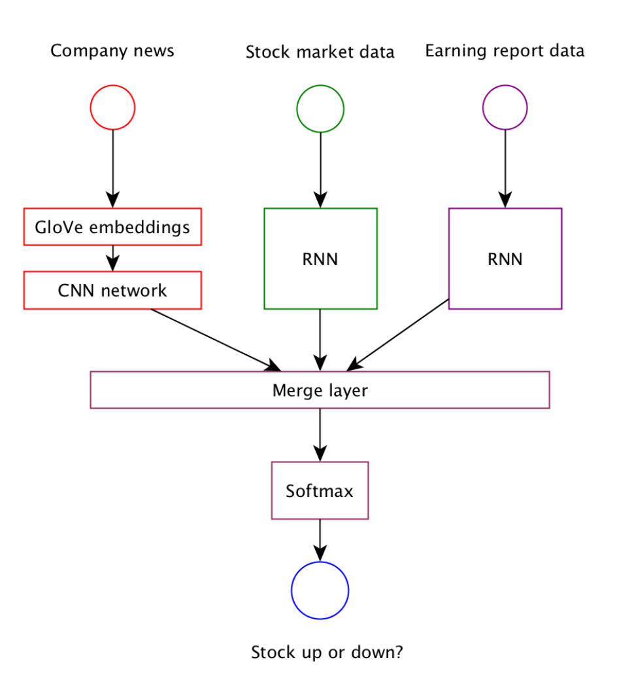

# Content: Specializations
## Project: Capstone Proposal and Capstone Project

## Capstone Proposal Overview
In my capstone project, I’d like to explore a possibility to forecast stock price trend
using machine learning techniques (such as word vector embeddings and Recurrent
Neural Networks).

### Domain background
There are several most common approaches to do stock market predictions (wiki):
- Fundamental analysis involves experts who analyze the company and industry
performance in comparison with others. This type of analysis is more focused on
the company (performance indicators, strength and weaknesses of leadership,
market share dynamics etc.) than on the studying the stock behavior itself. The
idea behind is to find over- or under-valued companies on the market and leverage
this knowledge.
- Technical analysis trading school tries to predict stock movements based on
certain observed trading patterns and behavioral dynamics (“head and shoulders”
strategy, stock momentum, mean reversion and others).
- Data mining which to some extend combines all available pieces of data about
company, stock and market, and trying to capture hidden patterns and connections
between different pieces. Various datasets and technical approaches have been
suggested (see Reference section for some examples).

In this proposal, I will use data mining approach. Based on my domain knowledge I
hypothesize that in most common case following factors influence on the company stock
price:
1. Overall stock market trends (“bullish” vs “bearish” market);
2. Trends in specific industry sectors (e.g. decline of classical retailers such as Sears,
Macy’s because of Amazon);
3. Known and hidden trading patterns on the market;
4. Companies fundamental parameters reported quarterly (such as profits, revenue,
cost of revenue, market capitalization etc.);
5. Public sentiment of specific company (e.g. public company bummers, M&A,
rotations of C-staff etc.);

### Datasets and Inputs
My choice of the data sets is driven by hypothesized factors in the “Domain
background” section and should represent these factors in some form:
- Trading patterns and trends are represented by historic stock prices (provided by
Quandl);
- Public sentiment is represented by company and industry news (provided by
Reuters, Google and Yahoo Finance);
- Fundamental parameters of companies are represented in Earnings reports
published by SEC (available via this API).
- General company information is captured in company profile (available on Yahoo
Finance)

##Project Design
The idea behind this proposal to build a complex machine
learning model which will account for various factors which influence on stock
movements. As the different factors has very different dataset (different sources and
internal data structure), I propose to select a several separate models which will be
assembled together to make a final prediction.
Model selections

####Model selections
* **Word embeddings**. I spent some time choosing between word2vec and GloVe
embeddings. Based on some of the published cases, both embeddings seems to
have similar performance. So I chose GloVe as it’s a bit easy to parallelize in
case of training your own embeddings. Currently I’m planning to try two options:
  * Using pre-trained GloVe weights (trained on wiki data).
  * Train GloVe on selected company news. The reason why I may choose
this option is that I’m expecting some confusion in wiki embeddings in
such cases as “Apple” (company) and “apple” (fruit).
* **CNN** for company’s news feed. I considered this model for following reasons:
  * Faster comparing to RNN.
  * As embeddings is effectively a 2D problem, CNN demonstrated
effectiveness in working with such types of data (learning high-level
features which in case of word embeddings can be associated with
meaning of the phrase)
* **RNN** for stock market data and earning report data.
  * Non-linear, robust to noise, can handle multivariate data.
  * Can learn the temporal context of the sequence. So this avoid creating a
fixed lag data sets.

##Status
This is work-in-progress project.

 